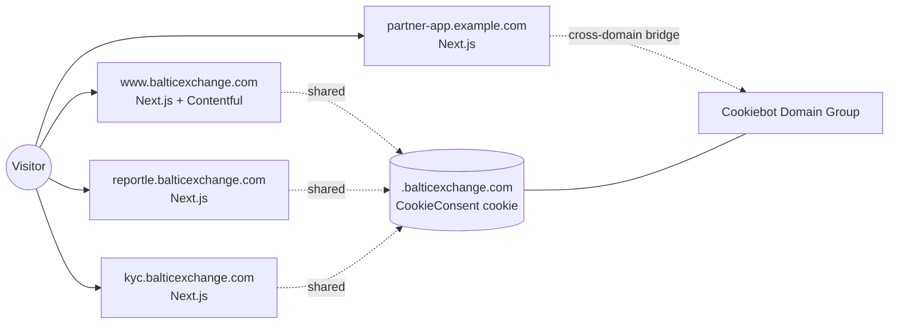

# Spike: Cookie Consent for Multi-Domain, Contentful-Managed Next.js Websites

- **Status:** Draft
- **Author:** Platform / Web
- **Date:** 2026-08-19
- **Scope:** balticexchange.com (Corporate Website) + sub-apps (Reportle, KYC, and any other properties running Google Analytics or marketing tags under or alongside balticexchange.com)

---

## 1. Problem statement

As a website visitor I want to manage my cookie preferences so that I can control how cookies are used across the Baltic Exchange web estate.

Today we need a single, legally-defensible consent experience that:

- Complies with **UK GDPR, EU GDPR, and PECR** (prior consent, granular categories, easy withdrawal, evidentiary audit trail).
- Supports **Google Consent Mode v2** so GA4 / Ads keep functioning lawfully in the EEA/UK.
- Covers **multiple Next.js apps** managed (fully or partly) via **Contentful**, deployed under one or more domains.
- Provides **one consent decision per user across the estate** where the domain structure allows (no repeated banners on every sub-app).
- Requires **no per-vendor manual gating** for standard third-party tags.

## 2. Constraints and assumptions

- Stack: **Next.js (App Router primarily; Pages Router in at least one app)**, content managed in **Contentful**, tags orchestrated via **Google Tag Manager (GTM)** where present.
- Hosting: Vercel or equivalent edge platform (assumed; CDN caching considered).
- Sub-apps sit either on subdomains of `balticexchange.com` or on separate registrable domains.
- Contentful has **no first-party consent product**; a CMP must be integrated at the app layer.
- Legal / DPO owns final categorisation sign-off; engineering owns integration.

## 3. Options considered

| Solution                                              | Auto-blocking       | Consent Mode v2 | Multi-domain sharing           | Auto cookie scan | IAB TCF | Audit trail | Rough cost |
| ----------------------------------------------------- | ------------------- | --------------- | ------------------------------ | ---------------- | ------- | ----------- | ---------- |
| **Cookiebot (Usercentrics)**                          | Yes                 | Yes (native)    | Yes (subdomain + cross-domain) | Yes (monthly)    | Yes     | Yes         | ££         |
| **OneTrust**                                          | Yes                 | Yes             | Yes                            | Yes              | Yes     | Yes         | ££££       |
| **Iubenda**                                           | Partial             | Yes             | Limited                        | Basic            | Yes     | Yes         | £          |
| **Osano**                                             | Yes                 | Yes             | Yes                            | Yes              | Partial | Yes         | ££         |
| **Klaro! / vanilla-cookieconsent (OSS, self-hosted)** | Manual gating       | Manual wiring   | DIY (postMessage)              | No               | No      | DIY         | Dev time   |
| **Contentful native**                                 | — no such product — | —               | —                              | —                | —       | —           | —          |

Non-goals for this spike: building a bespoke CMP. The regulatory surface (scan, categorisation, audit, TCF, Consent Mode) is not worth reimplementing.

## 4. Recommendation

Adopt **Cookiebot by Usercentrics** as the group-wide CMP, integrated via a **shared internal package** (`@baltic/consent`) consumed by every Next.js app in the estate.

**Why Cookiebot over the alternatives:**

1. **Auto-blocking** (`data-blockingmode="auto"`) rewrites third-party scripts until consent — removes per-vendor engineering work.
2. **Native Google Consent Mode v2** support with straightforward defaults.
3. **Cross-subdomain and cross-domain consent sharing** out of the box — key for our multi-app estate.
4. **Monthly automated scans** keep the cookie declaration accurate; policy page becomes self-maintaining.
5. Materially **cheaper than OneTrust** with equivalent compliance posture for our size.
6. First-class **GTM template** and vanilla `<script>` install — trivial to embed in Next.js via `next/script`.

Fallback: if procurement already holds a **OneTrust** licence, use OneTrust — the integration shape below is functionally identical (swap loader + event names).

## 5. Architecture

### 5.1 Domain topology and consent sharing

Two patterns coexist:

- **Pattern A — subdomains of `balticexchange.com`** (e.g. `www.`, `reportle.`, `kyc.`):
  - Cookiebot writes the `CookieConsent` cookie at `.balticexchange.com` scope.
  - All sub-apps read the same decision → **one banner, one decision, estate-wide**.
- **Pattern B — separate registrable domains** (e.g. a partner-facing app on its own domain):
  - Enable **cross-domain consent sharing** in the Cookiebot Domain Group.
  - Each app embeds the same loader with the same `data-cbid`; Cookiebot syncs decisions via a hidden iframe + postMessage bridge.
  - A banner may re-appear on first visit to a new registrable domain (regulatory necessity, not a bug).



### 5.2 Shared internal package: `@baltic/consent`

A tiny package published to the internal registry, versioned, consumed by every Next.js app.

Exports:

- `<ConsentDefaults />` — inline script setting Consent Mode v2 defaults to `denied` (must render before any GA/GTM).
- `<CookiebotLoader />` — the `uc.js` loader with `data-blockingmode="auto"`.
- `<CookieDeclaration />` — the `cd.js` embed for the policy page.
- `useConsent()` — React hook returning `{ necessary, preferences, statistics, marketing, ready }`.
- `<ConsentGate category="marketing">…</ConsentGate>` — renders children only when the category is granted.
- `openPreferences()` — calls `window.Cookiebot.renew()` for the footer link.
- Types shim for `window.Cookiebot`.

Benefits: every app integrates identically; upgrades (e.g. new Consent Mode signals) ship as a single package bump.

## 6. Next.js integration (App Router)

### 6.1 Layout wiring

`app/layout.tsx` in each app:

```tsx
import { ConsentDefaults, CookiebotLoader } from "@baltic/consent";

export default function RootLayout({
  children,
}: {
  children: React.ReactNode;
}) {
  return (
    <html lang="en">
      <head>
        <ConsentDefaults />
        <CookiebotLoader cbid={process.env.NEXT_PUBLIC_COOKIEBOT_ID!} />
      </head>
      <body>{children}</body>
    </html>
  );
}
```

Both components use `next/script` with `strategy="beforeInteractive"` so consent state is established before any tag manager or analytics fires.

### 6.2 GA4 / GTM

Loaded via `next/script` with `strategy="afterInteractive"` **after** the CMP. Because defaults are `denied`, GA4 sends cookieless "consent-denied" pings until the user accepts; Cookiebot then emits the `update` call automatically — no bespoke wiring per app.

### 6.3 Gating first-party embeds

For anything loaded outside GTM (Vimeo, HubSpot, Intercom, custom pixels) wrap in `<ConsentGate>`:

```tsx
<ConsentGate category="marketing">
  <HubSpotForm id="..." />
</ConsentGate>
```

The gate listens for `CookiebotOnAccept` / `CookiebotOnDecline` and re-renders.

### 6.4 Cookie policy page (Contentful-driven)

`app/cookie-policy/page.tsx`:

- Body copy comes from Contentful (rich text) so Legal owns the wording.
- The auto-generated declaration table is embedded via `<CookieDeclaration />` — regenerated monthly by Cookiebot's scan.

### 6.5 Footer preferences link

Single button in the shared footer component:

```tsx
<button onClick={openPreferences}>Cookie preferences</button>
```

Satisfies the "easy withdrawal" requirement uniformly across the estate.

### 6.6 Pages Router apps

Same components, mounted in `pages/_document.tsx` (`<Head>`) and/or `pages/_app.tsx`. Behaviour identical.

## 7. SSR, hydration, and caching notes

- All consent logic runs **client-side**. Do not import `@baltic/consent` internals into Server Components beyond the `<Script>` wrappers.
- Do **not** branch server-rendered markup on `document.cookie` — would cause hydration mismatches. Gate at runtime via `useConsent()` / `<ConsentGate>`.
- CDN caching: Cookiebot runs client-side, so **no `Cache-Control` changes required**. If a `middleware.ts` reads cookies to vary responses, exclude `CookieConsent` from the vary key (its value is not personalising HTML).
- Bundle impact: loader is ~30 KB gzipped, fetched from Cookiebot's CDN, not shipped in the Next.js bundle.

## 8. Configuration

Per-app environment:

```
NEXT_PUBLIC_COOKIEBOT_ID=<domain-group-id>
NEXT_PUBLIC_GA_ID=G-XXXXXXX
```

`NEXT_PUBLIC_COOKIEBOT_ID` is safe to expose — it is a public identifier.

Cookiebot dashboard configuration (one-time, centrally owned):

- Register every domain and subdomain in a single **Domain Group**.
- Enable **cross-subdomain consent** and, where needed, **cross-domain consent sharing**.
- Enable **Google Consent Mode v2** integration.
- Enable **IAB TCF v2.2** only if ad-tech vendors require it.
- Configure banner copy, styling, and language variants to match brand.

## 9. Cross-app rollout plan

1. **Provision** the Cookiebot tenant; add all domains to one Domain Group.
2. **Publish `@baltic/consent` v0.1.0** to the internal registry with the components above.
3. **Corporate site (`www.balticexchange.com`) — pilot:**
   - Integrate `@baltic/consent`.
   - Add `/cookie-policy` page powered by Contentful + `<CookieDeclaration />`.
   - Verify banner, Consent Mode signals in GA4 DebugView, and that no third-party requests fire pre-consent (DevTools → Network, "Preserve log").
4. **Reportle** integration to validate **cross-subdomain** consent sharing.
5. **Remaining sub-apps** (KYC, others) roll out via the same package version.
6. **Any external-domain apps** roll out with cross-domain sharing enabled.
7. **Retire** any legacy/bespoke banners.
8. **Publish** the updated cookie policy; announce internally.

## 10. Governance

- **Owner:** Marketing Ops (day-to-day) with DPO oversight.
- **Monthly:** review Cookiebot scan report; adjust categorisation; sign off changes.
- **Release checklist item** (added to every app's PR template): "New third-party script? Confirm it is categorised in Cookiebot before merge."
- **Package upgrades:** `@baltic/consent` bumps go through the normal internal package release process; consuming apps pin a minor version.

## 11. Risks and mitigations

| Risk                                                                                        | Mitigation                                                                                                                                |
| ------------------------------------------------------------------------------------------- | ----------------------------------------------------------------------------------------------------------------------------------------- |
| A vendor script slips in un-gated                                                           | `data-blockingmode="auto"` catches most; PR checklist + monthly scan catches the rest.                                                    |
| Cross-domain sharing fails behind strict browser privacy (ITP, third-party cookie blocking) | Expected — banner re-appears on the new registrable domain; consent decision is still recorded per domain and Consent Mode still applies. |
| Consent Mode defaults not applied before GA loads                                           | Enforced by `strategy="beforeInteractive"` on `<ConsentDefaults />` and code review of the shared package.                                |
| Contentful editors edit the cookie declaration table                                        | Declaration is rendered by Cookiebot script, not Contentful; policy body stays editable, declaration is read-only.                        |
| CMP outage blocks page render                                                               | Loader is async; page renders without it. Third-party tags simply do not fire until CMP recovers — acceptable degradation.                |
| Vendor lock-in                                                                              | Integration is isolated in `@baltic/consent`; swapping to OneTrust or another CMP is a package internals change, not a per-app rewrite.   |

## 12. Success criteria

- One consent banner shown per registrable domain, never repeated within a domain after a decision.
- GA4 DebugView shows `consent-denied` pings pre-consent and `consent-granted` pings post-accept.
- No third-party network requests before consent for non-necessary categories (verified in DevTools).
- Cookie policy page auto-updates from the monthly Cookiebot scan.
- Footer "Cookie preferences" link re-opens the banner on every app.
- Consent receipts retrievable from the Cookiebot dashboard for audit.

## 13. Open questions

- Final list of domains and subdomains in scope (needs confirmation from each app team).
- Which apps currently use GTM vs. direct GA4 install (affects sequencing of integration work).
- Do any apps use ad-tech that mandates **IAB TCF v2.2**? If yes, enable in dashboard.
- Preferred banner design tokens (colours, typography) for brand alignment.
- Language variants required at launch (EN only, or additional?).

## 14. Decision requested

Approve **Cookiebot** as the group CMP and greenlight the `@baltic/consent` shared package as the standard integration path for all Next.js + Contentful apps in the estate.

